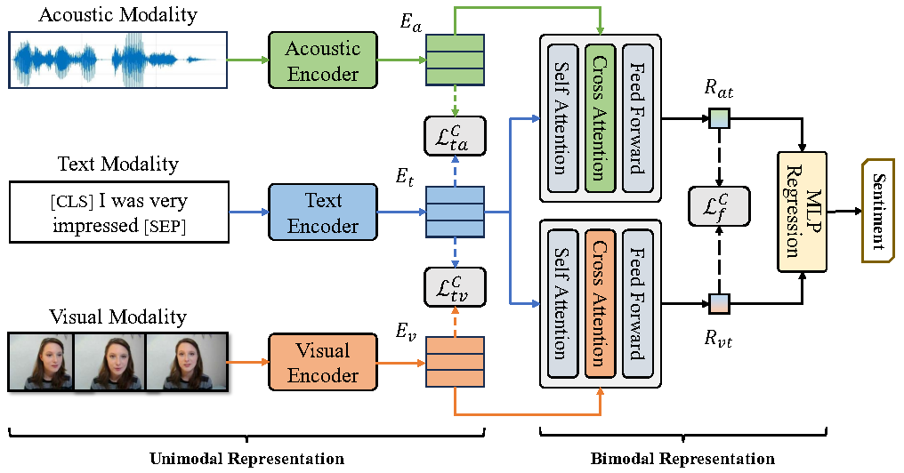

# Hierarchical Supervised Contrastive Learning for Multimodal Sentiment Analysis

This repository contains the official implementation code of the paper [Hierarchical Supervised Contrastive Learning for Multimodal Sentiment Analysis](https://link.springer.com/chapter/10.1007/978-3-031-53308-2_5), accepted at **International Conference on Multimedia Modeling, 2024**.

## Introduction

HSCL introduce supervised contrastive learning and propose a hierarchical training strategy for Multimodal Sentiment Analysis. 



## Usage

1. Download the CMU-MOSI and CMU-MOSEI dataset from [Google Drive](https://drive.google.com/drive/folders/1djN_EkrwoRLUt7Vq_QfNZgCl_24wBiIK?usp=sharing). Download the pretrained BERT model from [Huggingface](https://huggingface.co/google-bert/bert-base-uncased/tree/main).

2. Set up the environment.

```
conda create -n HSCL python=3.7
conda activate HSCL
pip install -r requirements.txt
```
If you encounter the following error: `ERROR: No matching distribution found for torch==1.8.0+cu111`, please run `pip install torch==1.8.0+cu111 -f  https://download.pytorch.org/whl/cu111/torch_stable.html`.
3. Start training.

Training on CMU-MOSI:

```
python main.py --dataset mosi --data_path [your MOSI path] --bert_path [your bert path]
```

Training on CMU-MOSEI:

```
python main.py --dataset mosei --data_path [your MOSEI path] --bert_path [your bert path] --when 5 --omega2 0.05 --lr_main 2e-4 --lr_bert 1e-5
```

## Citation

Please cite our paper if you find our work useful for your research:

```bibtex
@inproceedings{chen2024hierarchical,
  title={Hierarchical Supervised Contrastive Learning for Multimodal Sentiment Analysis},
  author={Chen, Kezhou and Wang, Shuo and Hao, Yanbin},
  booktitle={International Conference on Multimedia Modeling},
  pages={56--69},
  year={2024},
  organization={Springer}
}
```

## Contact 

If you have any question, feel free to contact me through [chenkezhou@mail.ustc.edu.cn](chenkezhou@mail.ustc.edu.cn).
